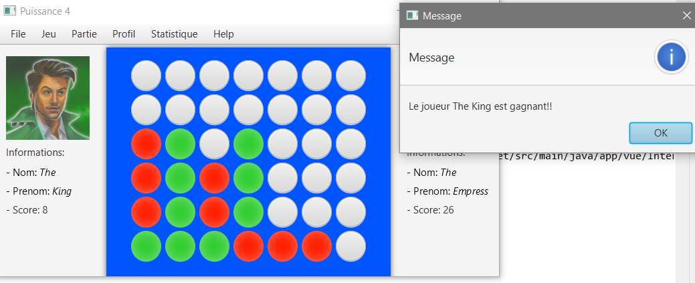
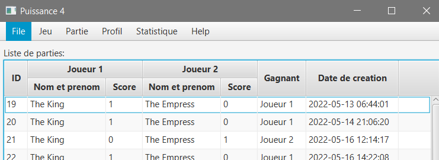
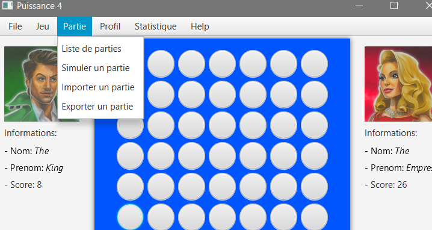

# puissance4

Learnt a new Java Framework called JavaFX. You can not only play with your friends but also export and import a game, moreover you can simulate an old game.

<table cellpadding="0">
  <tr style="padding: 0">
    <!-- GitHub Stats Card -->  
    <td valign="top">
         
    </td>
    <td valign="top">
         
     </td>
     <td valign="top">
         
     </td>
  </tr>
</table>

